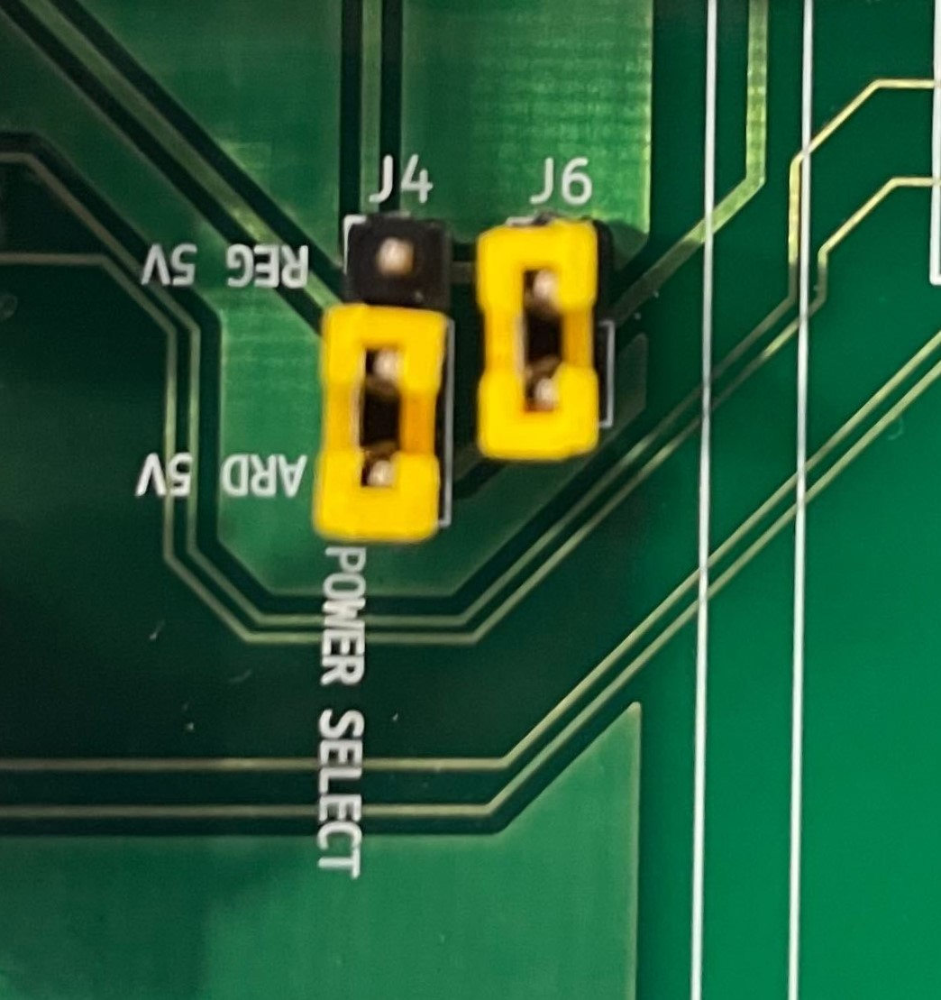
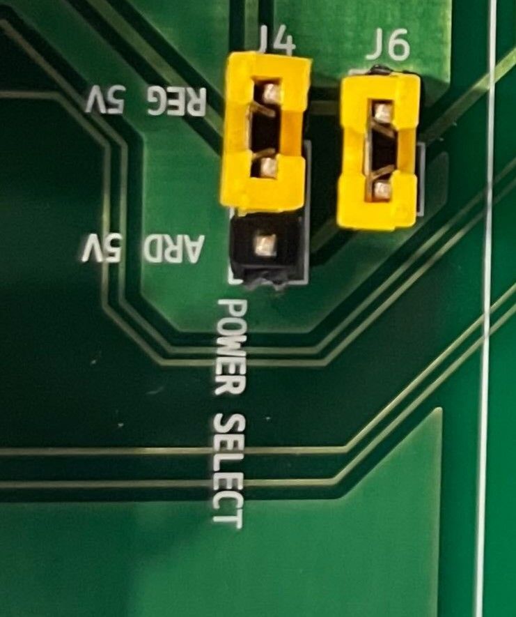

# RearSensor_Arduino  
Arduino Uno와 초음파센서를 활용하여 자동차 후방센서를 구현한 프로젝트입니다. 

초음파 센서가 인식하는 거리에 따라 3색의 LED가 점등되고 소리가 난다.  

### 동작  ( LCD / LED / Buzzer )
- 5cm이하일 때 : Good / 빨간색 / 부저  
- 5cm에서 10cm 사이일 때 : SoSo / 녹색    
- 10cm 이상일 때 : Good / 파란색 

## 전원 공급
- USB전원으로 아두이노를 통한 공급
 
    
- 12V 전원 아답터를 이용한 공급
   
    

  
